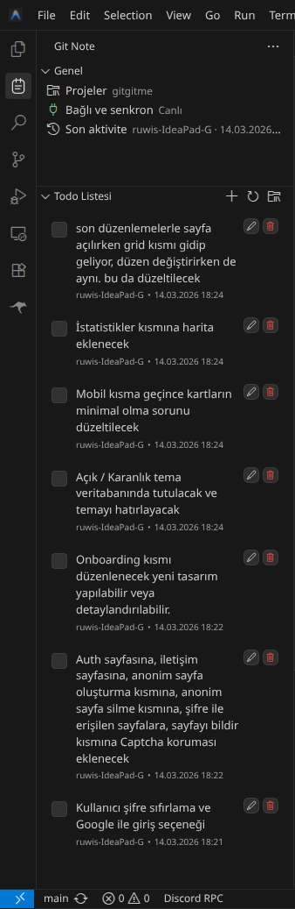

# Git Note

Firebase Realtime Database ile ortak kullanılan sade ve temiz bir VS Code todo/not eklentisi.

## Ekran Görüntüsü



## Özellikler

- Activity Bar içinde özel **Git Note** ikonu
- Üst kısımda native özet alanı, alt kısımda özel tasarlanmış native-benzeri todo listesi
- Firebase Realtime Database ile anlık senkronizasyon
- Proje / bucket mantığı: birden fazla ortak todo alanı
- Son seçilen projeyi hatırlama ve açılışta otomatik devam etme
- Todo ekleme, düzenleme, tamamlama ve silme
- Arkadaşının yaptığı değişiklikleri anlık görme
- Üst kısımda son aktiviteyi yapan cihaz adı + tarih/saat bilgisi
- Todo eklendiğinde, silindiğinde veya tamamlandığında sesli bildirim

## Firebase kurulumu

Bu proje kişisel kullanım için tasarlandığı için güvenlik tarafı sade tutuldu.

1. Firebase projesi oluştur.
2. **Realtime Database** etkinleştir.
3. Geliştirme / kişisel kullanım için kuralları geçici olarak açık yap:

```json
{
  "rules": {
    ".read": true,
    ".write": true
  }
}
```

4. Veritabanı URL'ini kopyala.

## Veritabanı adresi

Veritabanı adresi kod içine sabitlendi:

- `src/constants.ts`
- `https://xxxxx-default-rtdb.firebaseio.com`

Yani UI üzerinden ayrıca girmen gerekmez.

## Geliştirme

```bash
npm install
npm run compile
```

Sonra `F5` ile Extension Development Host aç.

## Kullanım

- Sol taraftaki **Git Note** ikonuna tıkla
- **Genel** bölümünde aktif proje, bağlantı durumu ve son aktivite görünür
- **Todo Listesi** bölümünde daha kontrollü, native-benzeri özel liste görünür
- Üstteki **Projeler** butonundan mevcut bucket'ları gör
- İstersen yeni proje / bucket oluştur
- Son seçtiğin proje kaydedilir ve yeniden açılışta otomatik yüklenir
- Üstteki `+` ile aktif projeye yeni todo ekle
- Todo satırlarında metnin tamamı görünür
- Satır üstü aksiyonlardan tamamla, düzenle veya sil

## Notlar

- Todo satırlarında görünen kişi bilgisi doğrudan cihaz adı olarak tutulur.
- Cihaz adı otomatik olarak sistem hostname bilgisinden alınır.
- Projeler Firebase içinde `git-note/buckets/<proje>` altında tutulur.
- Windows/Linux uyumluluğu için yalnızca harf, rakam ve `-` korunur; maksimum **15 karakter** kullanılır.

Bildirim sesleri extension içinde paketlenir ve yerel oynatıcılarla çalınır:

- macOS: `afplay`
- Windows: PowerShell beep
- Linux: `ffplay` fallback
